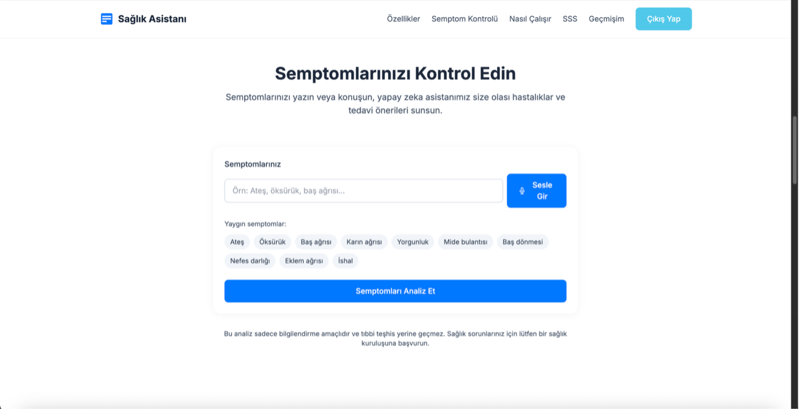
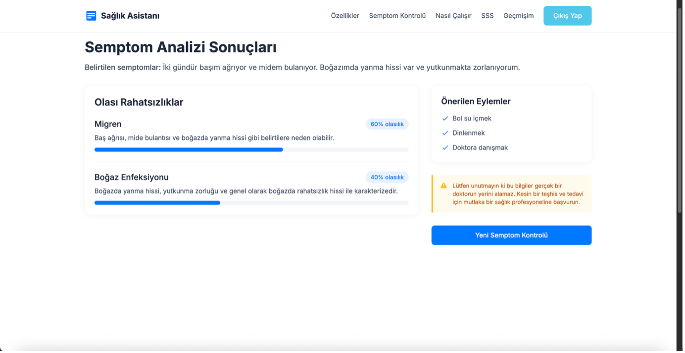
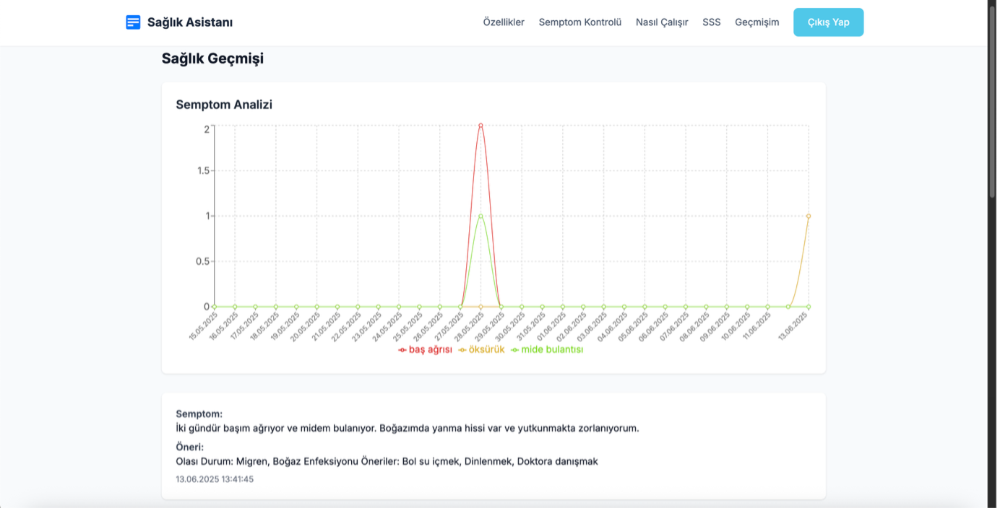

# Health Care AI Assistant

## About The Project

This project is a web-based bilingual health assistant that leverages OpenAI’s GPT-3.5 Turbo model to help users evaluate their symptoms. Users can input their symptoms via text or voice, and the system provides structured health advice, including possible medical conditions, recommended actions, and mandatory legal disclaimers. 

Developed as a graduation thesis at Çukurova University, this assistant bridges the gap in accessing clear, verified, and user-friendly medical information. To ensure high-quality and culturally accurate responses, the underlying language model was fine-tuned using a custom dataset of 100 curated medical simulation examples.

## Key Features

* **Bilingual Support**: The application dynamically accepts and processes inputs in both Turkish and English, producing responses that match the user's input language.
* **Voice Input**: Integrated Web Speech API allows users to interact with the system via voice commands, improving accessibility.
* **Structured & Safe AI Outputs**: Utilizing OpenAI's function calling capability, the AI generates predictable, structured JSON responses.
* **Health History Management**: Authenticated users can save their interactions securely in the cloud. Each analysis outcome is stored with a timestamp.
* **Data Visualization**: The dashboard uses interactive line charts to display symptom trends over time.

## Screenshots

### 1. User Input Interface
The main interface where users can enter symptoms via text or voice.

### 2. AI-Generated Results
Structured analysis showing possible conditions with probability scores and recommended actions.

### 3. Health History & Trends
Visualization of commonly reported symptoms over time using Recharts.

## Tech Stack

* **Frontend**: React.js, TypeScript
* **Styling & Animation**: Tailwind CSS, Framer Motion
* **Backend & Database**: Firebase Authentication, Cloud Firestore
* **AI Integration**: OpenAI API (Fine-tuned GPT-3.5 Turbo)
* **Data Visualization**: Recharts

## Disclaimer

This application functions as an initial educational resource and remains entirely separate from professional medical services. It is not a substitute for a real doctor and cannot provide medical diagnoses or treatments.
